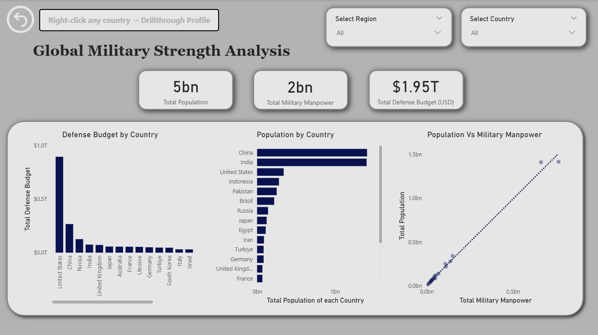
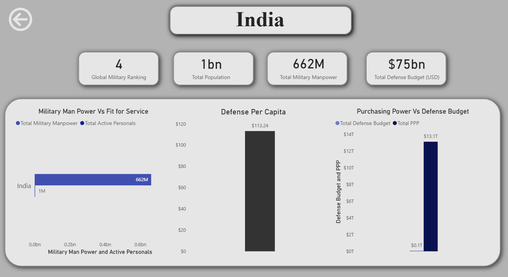
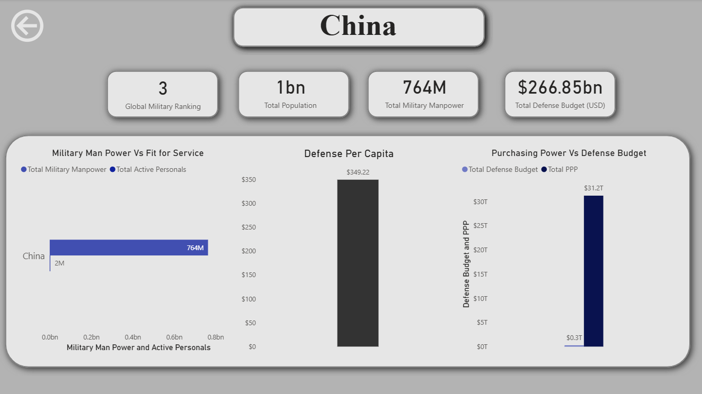
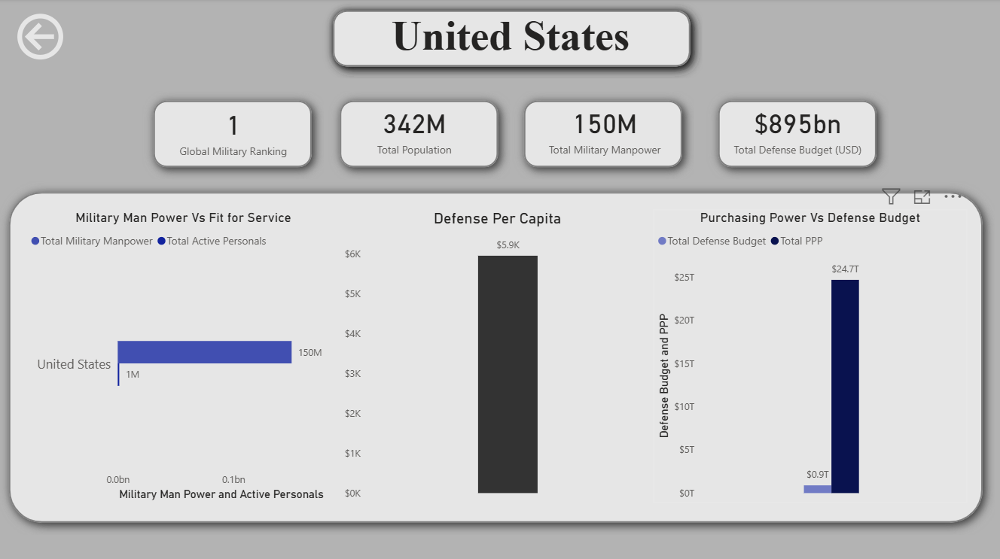

# Global Military Strength Analysis using Power BI

## Project Overview

This project presents an interactive Power BI dashboard built to analyze the military strength of major global powers using publicly available military capability data.
The dashboard combines demographic strength, military manpower, defense expenditure, and economic capability to understand how different countries translate national capacity into strategic military power.

The analysis is based on a trimmed dataset derived from the **Global Military Firepower 2025 dataset**, with focus placed on the top 20 countries for clear comparative analysis.

---

## Objective

The main objective of this project is to explore how military strength is influenced not only by defense spending, but also by:

* population size
* military manpower
* active service capability
* purchasing power parity (PPP)
* strategic economic strength

This project aims to demonstrate how multidimensional national indicators can be transformed into meaningful analytical insights through interactive dashboards.

---

## Dataset Source

* Source: Kaggle Global Military Firepower 2025 Dataset
* Dataset trimmed to top 20 countries for focused comparative analysis

---

## Tools Used

* Power BI
* Power Query
* DAX Measures

---

## Dashboard Workflow

### Page 1: Global Defense Overview

This page provides an executive overview of major global military powers.

### Included Analysis:

* Defense Budget by Country
* Population by Country
* Population vs Military Manpower relationship
* Total Population KPI
* Total Military Manpower KPI
* Total Defense Budget KPI
* Region and Country slicers for interactive filtering

### Purpose:

To compare strategic military scale across countries and identify dominant global patterns.

### Dashboard Preview - Global Defense Overview



---

### Page 2: Country Strategic Profile (Drillthrough Analysis)

This page uses drillthrough functionality to analyze a selected country individually.

### Included Analysis:

* Global Military Rank
* Total Population
* Total Military Manpower
* Total Defense Budget
* Military Manpower vs Active Personnel
* Defense Spending Per Capita
* Purchasing Power vs Defense Budget

### Purpose:

To understand how one country balances manpower, spending, and economic strength.

### Dashboard Preview - Country Strategic Profile




---

## Key DAX Measures Used

```DAX
Total Population = SUM(global_military_expenditure[total_population])

Total Military Manpower = SUM(global_military_expenditure[total_military_manpower])

Total Defense Budget = SUM(global_military_expenditure[defense_budget_usd])

Defense Per Capita = DIVIDE(
    SUM(global_military_expenditure[defense_budget_usd]),
    SUM(global_military_expenditure[total_population])
)
```

---

## Key Insights Derived

### Global Insights

* The United States shows the highest defense expenditure among selected countries, indicating strong financial military dominance.
* China and India lead in demographic military potential because of very large population bases.
* Population and military manpower show strong positive correlation across major powers.
* Defense expenditure does not always increase proportionally with manpower.

---

### Country-Level Strategic Insight (Example: India)

* India demonstrates strong demographic military strength with very high available manpower.
* Defense spending per capita remains lower compared to countries with smaller population bases.
* High purchasing power parity suggests strong internal economic support for long-term strategic growth.

---

## Analytical Interpretation

Military power is multidimensional.

A country’s strategic capability cannot be judged by defense budget alone.

The combination of:

* demographic capacity
* deployable manpower
* economic purchasing strength
* defense allocation

provides a better understanding of military readiness.

---

## Future Scope

This project can be extended further by including:

* naval strength analysis
* air force asset comparison
* logistics capability analysis
* oil and energy dependency indicators
* year-wise defense spending trends using external historical datasets
* geopolitical cluster analysis by region

Future versions may also integrate time-series military expenditure data from international defense databases for trend forecasting.

---

## Repository Structure

```text
global-military-strength-analysis-powerbi/
│── Dashboards/
│── dataset/
│── global_military_strength_analysis.pbix
│── README.md
```

---

## Author's Note

This project was built as a portfolio-level analytical dashboard to demonstrate Power BI dashboard design, DAX usage, drillthrough navigation, and analytical storytelling using geopolitical data.
